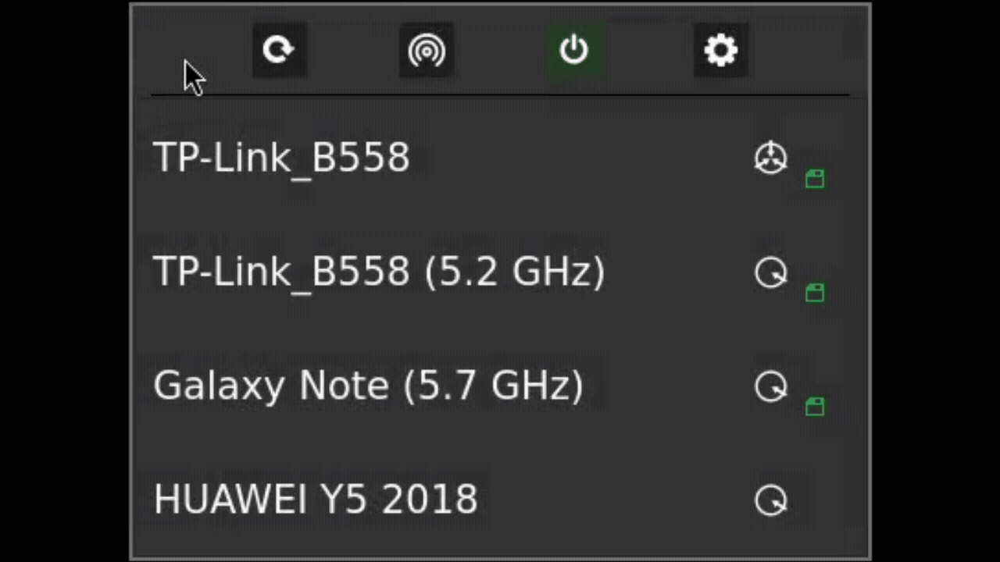

# SCP-WIFI-MANAGER: Foundation Personnel Network Utility

## Welcome, New Foundation Personnel!

Congratulations on securing your position within the SCP Foundation. Your security and operational efficiency are paramount. This SCP-WIFI-MANAGER utility is an essential tool provided to secure your workstation from potential cognitive hazards, data breaches, and unauthorized network infiltrations that may be encountered through unsecured wireless vector sources.

**Installation of this utility is mandatory for all Foundation-issued laptops.**

## Neural-Link Signal Telemetry

The interface utilizes a **proprietary signal font** (`scp-wifi-strength-font.ttf`) to render unique spectral resonance icons. Instead of standard bars, the system uses Foundation-coded glyphs to represent signal fidelity.

### Signal Level Mapping

| Icon Code | Strength Range | Foundation Designation |
| :---: | :--- | :--- |
| `\uE804` | 80% - 100% | **Optimal Alignment** (Maximum) |
| `\uE803` | 60% - 79% | **High Resonance** |
| `\uE802` | 40% - 59% | **Stable Connection** |
| `\uE801` | 20% - 39% | **Low Signal Fidelity** |
| `\uE800` | 0% - 19% | **Near-Zero Resonance** (Critical) |

## Operational Guide

### 1. Network Discovery
Scan the environment for local wireless anomalies. The UI utilizes a **proprietary signal font** (`scp-wifi-strength-font.ttf`) to render unique signal fidelity icons.

### 2. Secure Connection
Standard WPA2/RSN handshake protocols. 

### 3. Tactical Hotspot (SCP_Hotspot_Profile)
Deployment of a localized secure access point. The system automatically wipes the connection profile upon termination to ensure a zero-trace footprint.

### 4. Rapid Authentication (QR)
Bypass manual credential entry using encrypted visual handshakes.

---

### Technical Stack
* **Language:** C++ / Qt 6
* **Communication:** Asynchronous D-Bus (NetworkManager API)
* **Design:** Custom typography for telemetry visualization
